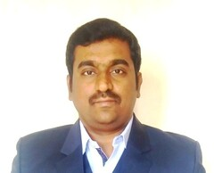

> Writing, to me, is simply thinking through my fingers.
> 
> --Isac Asimov

Hi there, I am Dr. Shrishail Gajbhar. Thanks for visiting my Tech(B)log, a technical log of my learning explorations. As a researcher, I am trying to comprehend the secrets of Artificial Intelligence (AI) focussing on its Image Processing (IP), Computer Vision (CV), Machine Learning (ML) and Deep Learning (DL) aspects. 

I have started this blog as a personal logbook to retrospect what I have learned.

#### About me

  
**Dr. Shrishail Sharad Gajbhar  
Ph.D in Information and Communication Technology (ICT)  
Email: <shrishailgajbhar5@gmail.com>**  

### \[[CV](CV_SSG.pdf){:target="_blank"}\] \[[Google Scholar](https://scholar.google.co.in/citations?user=ObE0HeYAAAAJ&hl=en){:target="_blank"}\] \[[GitHub](https://github.com/ShrishailSGajbhar){:target="_blank"}\] \[[LinkedIn](https://www.linkedin.com/in/shrishailgajbhar){:target="_blank"}\] \[[Kaggle](https://www.kaggle.com/shrishailgajbhar){:target="_blank"}\] \[[HackerRank](https://www.hackerrank.com/shrishailgajbha1){:target="_blank"}\] \[[SoloLearn](https://www.sololearn.com/Profile/19733903){:target="_blank"}\]
### News

* Recently completed an online Post Graduate Program in Machine Learning (PGP-ML) offered by [Great Learning](https://www.greatlearning.in/pg-program-machine-learning-course), an ed-tech company. [[view certificate](https://olympus1.greatlearning.in/certificate/RLYZBOCW){:target="_blank"}] [[view transcript](https://olympus1.greatlearning.in/transcript/RQWDHIVF){:target="_blank"}]  [[view e-portfolio](https://eportfolio.greatlearning.in/dr--shrishail-sharad-gajbhar){:target="_blank"}].

### Recent Research Interests

*	Deep Learning: CNN
*   Computer Vision: Object Detection
*   Machine Learning: Supervised and Unsupervised Learning, Ensemble Techniques, Recommendation systems.

### Work Experience

*   2017.07--Now: Assistant Professor, [WIT, Solapur](https://www.witsolapur.org/){:target="_blank"}, Maharashtra, India.
*   2012.07--2017.06: Research Scholar, [DA-IICT, Gandhinagar](https://www.daiict.ac.in/){:target="_blank"}, Gujarat, India.
*   2011.07--2012.06: Junior Research Fellow, [DA-IICT, Gandhinagar](https://www.daiict.ac.in/){:target="_blank"}, Gujarat, India..

### Education

*   2012.01--2017.12: Ph.D. (ICT), [DA-IICT, Gandhinagar](https://www.daiict.ac.in/){:target="_blank"}, Gujarat, India.
    * Thesis Title: ["Wavelets and filter banks: novel approaches for real and complex-valued transform designs"](http://drsr.daiict.ac.in/handle/123456789/650){:target="_blank"} [[View](201121016.pdf){:target="_blank"}\]
    * Supervisor: [Dr. Manjunath V. Joshi](http://intranet.daiict.ac.in/~mv_joshi/){:target="_blank"}
*   2009.06--2017.06: M.Tech. (Instrumentation Engg.), [SGGSIE&T, Nanded](https://sggs.ac.in/){:target="_blank"}, Maharastra, India.
    * Dissertation Title: "Personal verification system based on iris texture analysis" [[View](rootfile.pdf){:target="_blank"}\]
    * Supervisor: [Dr. Raghunath S. Holambe](https://onlinesggs.org/faculty_profile/users/view_profile.php?id=88){:target="_blank"}
*   2004.06--2008.06: B. Tech. (Ele. & Telecomm. Engg.), [SGGSIE&T, Nanded](https://sggs.ac.in/){:target="_blank"}, Maharastra, India.

---

### Journal Paper(s):

1. **Design of complex adaptive multiresolution directional filter bank and application to pansharpening**  
**Gajbhar, Shrishail S.**,  Joshi, Manjunath V.     
*Signal, Image and Video Processing (SIViP)*, vol. 11, no. 2, pp. 259--266, 2017, Springer London. [**Impact Factor: 1.79 as of 2019**]                
[\[Paper\]](https://link.springer.com/article/10.1007/s11760-016-0931-4) [\[Bibtex\]](./bibtex/2017SIVIP.html)

  
### Book Chapter(s)

1. **Image Denoising using Tight-Frame Dual-Tree Complex Wavelet Transform**  
**Gajbhar, Shrishail S.**,  Joshi, Manjunath V.  
In: Tanveer M., Pachori R. (eds) Machine Intelligence and Signal Analysis. Advances in Intelligent Systems and Computing, vol 748., pp. 645-656, 2019, Springer, Singapore.   
[\[Paper\]](https://link.springer.com/chapter/10.1007/978-981-13-0923-6_55) [\[Bibtex\]](./bibtex/2019MISA.html)  

1. **Design of Biorthogonal Wavelet Filters of DTCWT Using Factorization of Halfband Polynomials**  
**Gajbhar, Shrishail S.**, Joshi, Manjunath V.  
In: Rameshan R., Arora C., Dutta Roy S. (eds) Computer Vision, Pattern Recognition, Image Processing, and Graphics. NCVPRIPG 2017. Communications in Computer and Information Science, vol 841.  pp. 150-162, 2017, Springer, Singapore.  
[\[Paper\]](https://link.springer.com/chapter/10.1007/978-981-13-0020-2_14) [\[Bibtex\]](./bibtex/2017NCV.html)

Note: *These are the conference papers published as part of the Springer book series.*
### Conference Papers
1. **Image Denoising Using Redundant Finer Directional Wavelet Transform**  
**Gajbhar, Shrishail S.**,  Joshi, Manjunath V.  
The fourth National Conference on Computer Vision, Pattern Recognition, Image Processing and Graphics (NCVPRIPG 2013), Jodhpur, India, 19--21 December, 2013. **(Best Paper Award)**  
[\[Paper\]](https://ieeexplore.ieee.org/abstract/document/6776251) [\[Bibtex\]](./bibtex/2013NCV.html)

1. **Design of Extrafine Complex Directional Wavelet Transform and Application to Image Denoising**  
**Gajbhar, Shrishail S.**,  Joshi, Manjunath V.  
16th International Workshop on Multimedia Signal Processing (MMSP-2014), Jakarta, Indonesia, pp. 1-6, 22-24 Sept, 2014.    
[\[Paper\]](https://ieeexplore.ieee.org/abstract/document/6958794) [\[Bibtex\]](./bibtex/2014MMSP.html)

1. **Novel designs for nonsubsampled multiresolution directional filter banks and an extra finer directional wavelet transform**  
**Gajbhar, Shrishail S.**,  Joshi, Manjunath V.  
2nd IEEE China Summit and International Conference on Signal and Information Processing (ChinaSIP’14), Xi'an, China, pp. 339--343, 9--13 July, 2014.  
[\[Paper\]](https://ieeexplore.ieee.org/abstract/document/6290213) [\[Bibtex\]](./bibtex/2014CSIP.html)  

1. **Acoustical analysis of musical pillar of great stage of Vitthala temple at Hampi, India**  
Hemant A Patil, **Shrishail S Gajbhar**  
International Conference on Signal Processing and Communications (SPCOM), IISC, Bangalore, India, 2012.  
[\[Paper\]](https://ieeexplore.ieee.org/abstract/document/6290213) [\[Bibtex\]](./bibtex/2012SPCOM.html)  

---

Visit my  [Github profile](https://github.com/ShrishailSGajbhar?tab=repositories) to have a look on some of the projects that I’ve worked on.

Feel free to contact me on [LinkedIn](www.linkedin.com/in/dr-shrishail-gajbhar-55938039) or send an email on **shrishailgajbhar5@gmail.com**, if you want to discuss opportunities or collaboration.

Thanks for reading!

> A picture may be worth a thousand words, a formula is worth a thousand pictures.
> 
> — Edsger Dijkstra  

