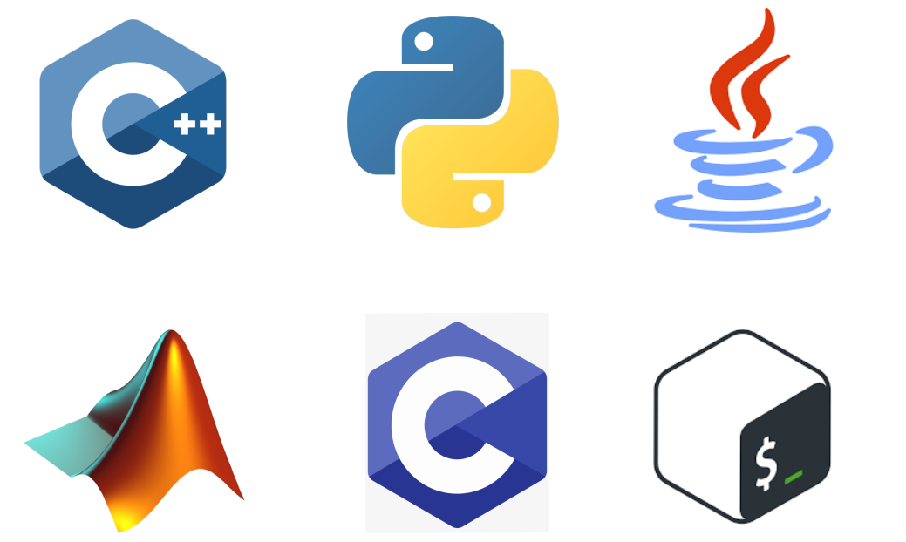
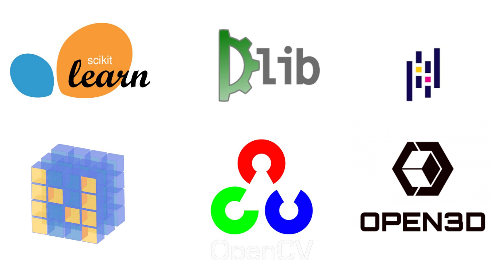
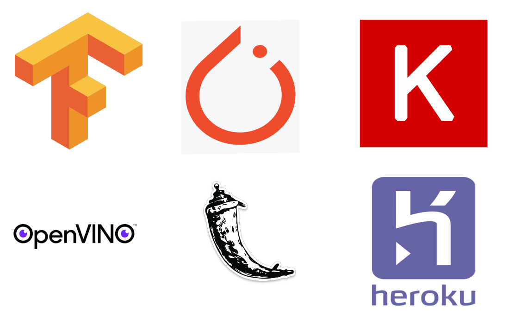

#### Programming Languages (Core, Scripting etc)
**• C++ • Python • Java • MATLAB • C • Shell Script**

---
#### Libraries (ML/CV/DL)
**• Scikit-Learn • Dlib • Pandas • Numpy • OpenCV • Open3D**

---
#### Frameworks 
**• TensorFlow 2.0 • Pytorch • Keras • OpenVINO • Flask • Heroku**

---
